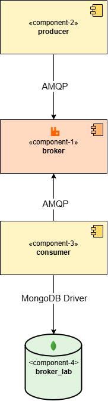
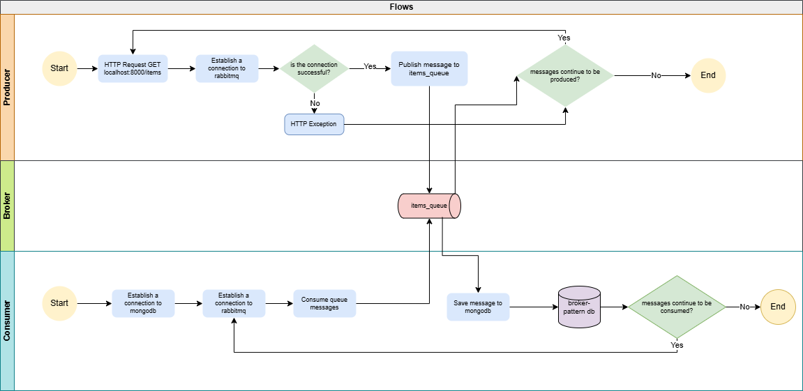

# 🏗️ Laboratory 4: Structural Architectural Patterns

  
  

---

## 👨‍💻 Author
**Julián Esteban Mendoza Wilches**, jmendozaw@unal.edu.co

---

## 📋 Table of Contents
- [Overview](#overview)
- [Component and Connector View](#component-and-connector-view-cc)
- [Flow Diagram](#flow-diagram)

---

## 🎯 Overview
This laboratory focuses on implementing and analyzing **Structural Architectural Patterns**, specifically exploring the **Broker Pattern** and its applications in distributed systems architecture.

---

## 🏛️ Architecture Diagrams

### Component and Connector View (C&C)

We can identify four components and three connectors in the cyc view:

### Components
* ***component-2***: This component acts as the producer in our broker-pattern example. It is in charge of establish a connection to rabbitmq server, create a queue and send messages to be enqueued.

* ***component-1***:This component corresponds to a broker.This works as an intermediary that facilitates message exchanges. We use rabbit mq to implement this component and is build through docker. This component acts as a central communication point, allowing producers (component-2) to send messages to queues, where consumers (component-3) can process them ***asynchcorously***.

* ***component-3***: This component takes the role of consumer. It will consume message from the queue that is located at the component-1. Besides that it also will save the consumed messages in a nosql db.

* ***component-4***: This is a database component and it is in charge of save the messages sent by component-3.

### Connectors:
* ***AMQP Connector***: This connector is present two times in the architecture. It implements AMQP protocol which provides a set of rules for message formatting, routing, and delivery, ensuring consistency across various implementations. We can see this connector between component-2(producer) and component-1(broker) and component-1(broker) and component-3(consumer).

  

### Flow Diagram
This diagram shows the asynchronous communication flow between system components,as you can see, there are different processes occurring at the same time, for example: while producer sends messages to the queue the consumer is already listening to the broker and consuming this messages .For that reason the diagram has three swim lanes: producer, broker and consumer.

  

---

  <i>Software Architecture, Universidad Nacional de Colombia</i>

